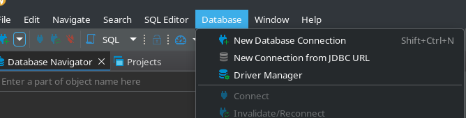

Antes de poder conectarte a una base de datos, necesitas instalar los programas ([instrucciones acá](./inst_gen.html))

# PostgreSQL y SQLite

Los motores que vamos a utilizar son PostgreSQL y SQLite.
Funcionan de maneras muy diferentes.

PostgreSQL funciona con un esquéma "servidor/cliente", es decir que para conectarse, tenemos que dar 4 informaciones principales:

* la dirección del servidor (`host`): puede ser una dirección IP como la dirección que recibieron por correo, pero puede ser también una URL, o la palabra `localhost` si la base de datos está en la misma maquina que el cliente (en sus computadores)
* el usuario (`user`) que van a utilizar para conectarse (en el caso de las bases de datos postgres que vamos a manejar durante los talleres, lo recibieron por correo)
* la contraseña (`password`) que van a utilizar para conectarse (en el caso de las bases de datos postgres que vamos a manejar durante los talleres, lo recibieron por correo)
* el nombre de la base de datos 

SQLite funciona con un archivo que contiene toda la base de datos.
Para utilizar SQLite y conectarse a la base de datos, es suficiente descargar este archivo y indicarlo al sistema.

# Utilizar DBeaver

Al abrir DBeaver, deberían ver:

Para conectar una nueva base de datos (por ejemplo, vamos a utilizar una base de datos que se llama 'biodata1'), ir a 'Database' -> 'New Database Connection'

Seleccionar 'PostgreSQL'

Cambiar los valores en:

* host: poner la dirección ip
* Database: biodata1
* Username: el usuario que recibieron por correo
* Password: la contraseña que recibieron por correo

Hacer click en 'Finish' y ¡ya están conectado a la base de datos biodata1 del taller!