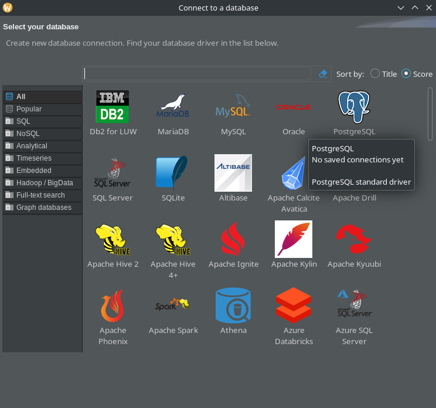

Antes de poder conectarte a una base de datos, necesitas instalar los programas ([instrucciones acá](./inst_gen.html))

# Organización de las carpetas y descarga de archivos
Les aconsejo:

1. crear una carpeta general para el simposio
1. crear una carpeta "Datos" y una carpeta por taller en esta carpeta general
1. descargar los datos en <https://drive.google.com/drive/folders/1hhUUtx8-aXsG2gluId5wxlIHnrva0EmI?usp=drive_link> y ponerlos en la carpeta "Datos"

En cada documento que contiene código y documentación en este sitio web, pueden descargar los comandos, les aconsejo ponerlos en las carpetas que corresponden a cada uno de los talleres.
Si cuando descargan los comandos, abren directamente en explorador internet, pueden abrir cualquier editor de texto (por ejemplo el bloc de notas de Windows, o RStudio), copiar el contenido en el archivo y guardarlo en la carpeta adecuada, con la extensión que corresponde (`.sql` para los comandos SQL, `.R` para los scripts R) 

](./Figs/descarga_comandos.png)

# PostgreSQL y SQLite

Los motores que vamos a utilizar son PostgreSQL y SQLite.
Funcionan de maneras muy diferentes.

PostgreSQL funciona con un esquéma "servidor/cliente", es decir que para conectarse, tenemos que dar 4 informaciones principales:

* la dirección del servidor (`host`): puede ser una dirección IP como la dirección que recibieron por correo, pero puede ser también una URL, o la palabra `localhost` si la base de datos está en la misma maquina que el cliente (en sus computadores)
* el usuario (`user`) que van a utilizar para conectarse (en el caso de las bases de datos postgres que vamos a manejar durante los talleres, lo recibieron por correo)
* la contraseña (`password`) que van a utilizar para conectarse (en el caso de las bases de datos postgres que vamos a manejar durante los talleres, lo recibieron por correo)
* el nombre de la base de datos 

SQLite funciona con un archivo que contiene toda la base de datos.
Para utilizar SQLite y conectarse a la base de datos, es suficiente descargar este archivo y indicarlo al sistema.

# Utilizar DBeaver

## Crear una conexión con una base de datos PostgreSQL
Al abrir DBeaver, deberían ver:

Para conectar una nueva base de datos (por ejemplo, vamos a utilizar una base de datos que se llama 'biodata1'), ir a 'Database' -> 'New Database Connection'

Seleccionar 'PostgreSQL'

Cambiar los valores en:

* host: poner la dirección ip
* Database: biodata1
* Username: el usuario que recibieron por correo
* Password: la contraseña que recibieron por correo

Hacer click en 'Finish' y ¡ya están conectado a la base de datos biodata1 del taller!

## Abrir una base de datos SQLite en DBeaver

El principio es lo mismo que para las bases de datos, en lugar de PostgreSQL, seleccionar SQLite, y indicar el archivo que contiene la base de datos SQLite en sus computadores (por ejemplo el archivo 'biodata1.sqlite3' es un archivo que contiene una base de datos SQLite).

## Consultar la base de datos en DBeaver

Ahora que tienen la conexión a la base de datos pueden conectar (con un click en la base de datos en el panel a la izquierda de la interfaz de DBeaver).

Desde acá pueden buscar en google las funcionalidades de DBeaver, pero les voy a explicar como abrir un archivo sql y interactuar con la base de datos:

En DBeaver, hacer un click derecho sobre la base de datos, ir a 'SQL Editor' -> 'Open SQL script' 

Luego ir a 'File' -> 'Save As' y guardarlo como un archivo en la carpeta que van a utilizar para el taller

Ahora, pueden escribir comandos en SQL. 
Cuidado, no olvidar que para terminar un comando SQL, tienen que terminar por ';'.

Para ejecutar un comando que han escrito en el archivo SQL, seleccionar el texto y 'Ctrl + Enter'.

Pueden tambien abrir una consola en la base de datos que seleccionaron por ir a 'SQL Editor' -> 'Open SQL console' en lugar de 'Open SQL script'.

Así pueden escribir directamente los comandos en la consola o copiar/pegar los comandos en la consola.

# Revisar o descubrir los lenguajes antes de los talleres 

En este sitio, en la parte 'R y SQL', les aconsejo mirar las documentación de SQL y R antes de ir a los talleres, les permitirá refrescar y/o descubrir algunas nociones de base sobre esos lenguajes que utilizaremos en los talleres.

En particular, mirar los documentos siguientes:

SQL:

* [consultas simples](doc_SQL_simple.html)
* [Consultas tablas múltiples](doc_SQL_consultas_avanzadas.html)

R:

* [Modos y clases](doc_R_clases_modos.html)
* [Importar y exportar datos](doc_R_import_export.html)
* [Buscar datos y relacionar objetos](doc_R_buscarRelacionar.html)

Les aconsejo descargar los comandos y integrarlos en DBeaver para SQL, empezar a modificar los comandos y mirar los resultados.

De la misma manera, abrir los scripts R y jugar con los comandos en RStudio puede ser muy util.

En los talleres, podremos hablar de los comandos que no entienden, ademas de avanzar en los ejercicios!
Si ya tienen un poco de practica reciente antes de llegar a los talleres, podría resultar mucho más eficiente!

